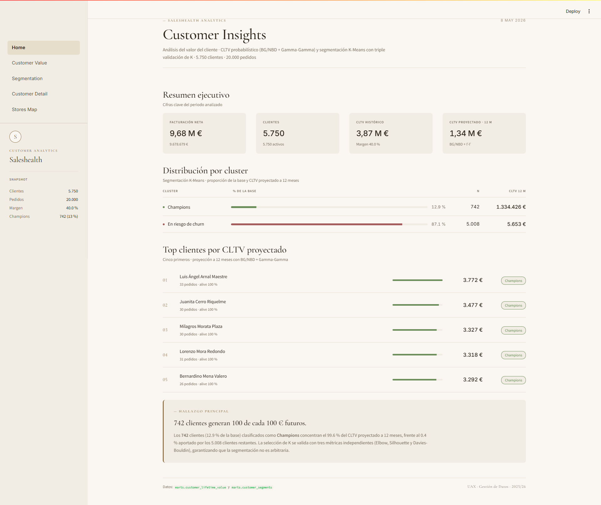
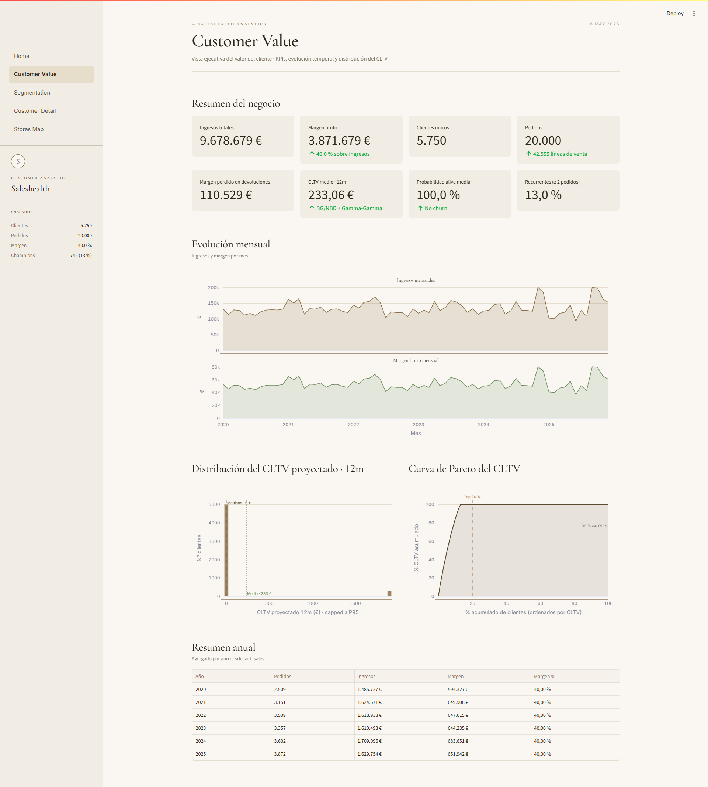
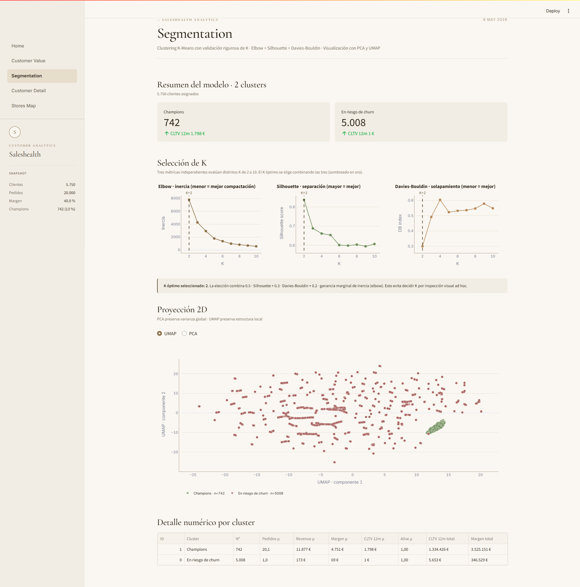
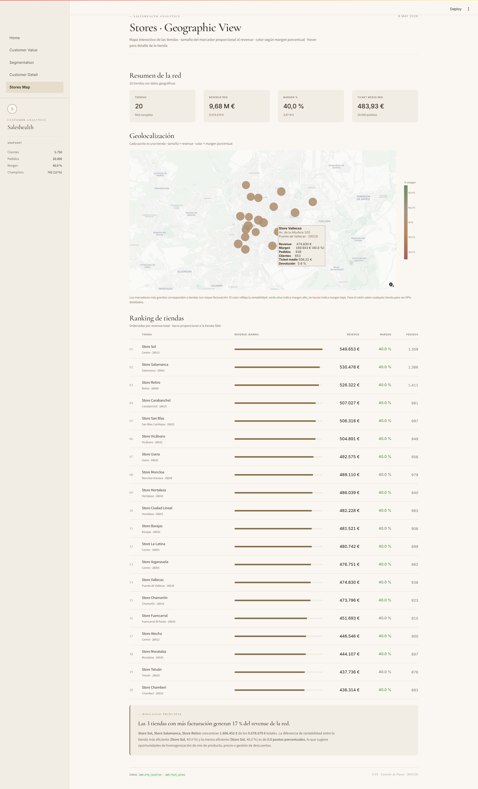

# Saleshealth CLTV

Pipeline ETL + dashboard analítico para el cálculo de **Customer Lifetime Value (CLTV)** y segmentación de clientes sobre la base de datos Saleshealth.

Proyecto Final · Gestión de Datos · UAX 2025/26

---

## Índice

- [Descripción](#descripción)
- [Arquitectura](#arquitectura)
- [Tecnologías](#tecnologías)
- [Estructura del proyecto](#estructura-del-proyecto)
- [Instalación](#instalación)
- [Uso](#uso)
- [Dashboard](#dashboard)
- [Modelo de datos](#modelo-de-datos)

---

## Descripción

El proyecto toma los datos transaccionales de Saleshealth (ventas, devoluciones, clientes, productos y tiendas) y construye un pipeline completo que:

1. **Extrae** los datos desde la base de datos origen hacia una capa de staging.
2. **Transforma** el staging en un modelo en estrella (Data Warehouse).
3. **Valida** la calidad del dato antes de la capa analítica.
4. **Calcula el CLTV** con modelos probabilísticos BG/NBD + Gamma-Gamma (estándar de industria de Fader & Hardie).
5. **Segmenta** los clientes con K-Means + triple validación del K óptimo (Elbow, Silhouette, Davies-Bouldin) + reducción UMAP para visualización.
6. **Expone** los resultados en un dashboard Streamlit interactivo.

---

## Arquitectura

```
PostgreSQL (origen)
        │
        ▼
  stg schema         ← extract.py: copia 1:1 sin transformar
        │
        ▼
  dwh schema         ← transform_dimensions.py + transform_facts.py
  (modelo estrella)    4 dimensiones + 2 tablas de hechos
        │
        ▼
  marts schema       ← cltv.py + cluster.py
  (capa analítica)     customer_lifetime_value + customer_segments
        │
        ▼
  Streamlit Dashboard
```

**Capas:**

| Schema | Descripción |
|--------|-------------|
| `stg`  | Staging — réplica bruta del origen |
| `dwh`  | Data Warehouse — modelo en estrella con surrogate keys |
| `marts`| Marts analíticos — CLTV y segmentos pre-calculados |

---

## Tecnologías

| Componente | Tecnología |
|---|---|
| Base de datos | PostgreSQL |
| Lenguaje | Python 3.11 |
| Acceso BD | psycopg 3 |
| Datos | pandas, numpy |
| Modelado CLTV | lifetimes (BG/NBD + Gamma-Gamma) |
| Clustering | scikit-learn (K-Means, PCA) |
| Visualización 2D | umap-learn |
| Dashboard | Streamlit + Plotly |

---

## Estructura del proyecto

```
saleshealth-cltv/
│
├── run.py                      # Orquestador del pipeline (punto de entrada)
├── requirements.txt            # Dependencias Python
├── .env.example                # Plantilla de variables de entorno
│
├── etl/                        # Pipeline ETL
│   ├── config.py               # Conexión a la base de datos
│   ├── bootstrap.py            # Crea la BD destino y aplica el DDL
│   ├── extract.py              # Extracción: origen → stg
│   ├── transform_dimensions.py # Transformación: stg → dwh (dimensiones)
│   ├── transform_facts.py      # Transformación: stg → dwh (hechos)
│   ├── validate.py             # Validación de calidad del dato
│   ├── cltv.py                 # Modelos BG/NBD + Gamma-Gamma → marts
│   ├── cluster.py              # K-Means + UMAP → marts
│   └── schema.sql              # DDL completo (stg + dwh + marts)
│
├── app/                        # Dashboard Streamlit
│   ├── Home.py                 # Página principal — KPIs ejecutivos
│   ├── data_access.py          # Capa de acceso a datos (queries)
│   ├── theme.py                # Estilos y componentes visuales
│   └── pages/
│       ├── 1_Customer_Value.py # Distribución de CLTV
│       ├── 2_Segmentation.py   # Análisis de segmentos
│       ├── 3_Customer_Detail.py# Detalle individual de cliente
│       └── 4_Stores_Map.py     # Mapa geográfico de tiendas
│
├── data/
│   ├── raw/                    # SQL dumps del origen (no versionados)
│   └── exports/                # Outputs del pipeline (métricas de clustering)
│
└── docs/
    ├── Saleshealth_Documento_Tecnico.pdf
    ├── diagrams/               # Modelo ER, dimensional y flujo ETL
    └── screenshots/            # Capturas del dashboard
```

---

## Instalación

### Prerrequisitos

- Python 3.11
- PostgreSQL con la base de datos `saleshealth` cargada

### 1. Crear entorno virtual e instalar dependencias

```bash
python -m venv venv
source venv/bin/activate        # Linux/Mac
venv\Scripts\activate           # Windows

pip install -r requirements.txt
```

### 2. Configurar variables de entorno

```bash
cp .env.example .env
```

Edita `.env` con tus credenciales:

```env
DB_HOST=localhost
DB_PORT=5432
DB_USER=postgres
DB_PASSWORD=tu_contraseña

DB_NAME_SOURCE=saleshealth       # BD origen (ya existente)
DB_NAME_DWH=saleshealth_cltv     # BD destino (se crea automáticamente)
```

---

## Uso

El orquestador `run.py` gestiona todas las fases del pipeline:

```bash
# Primera ejecución completa
python run.py --all

# O fase por fase
python run.py --bootstrap    # Crea la BD saleshealth_cltv y aplica el DDL
python run.py --extract      # Copia datos: saleshealth → stg
python run.py --transform    # stg → dwh (dimensiones + hechos)
python run.py --validate     # Checks de calidad del dato
python run.py --cltv         # Calcula CLTV (BG/NBD + Gamma-Gamma)
python run.py --cluster      # Segmentación K-Means + UMAP
```

**Flujo recomendado para la primera vez:**

```bash
python run.py --bootstrap --extract
python run.py --transform --validate
python run.py --cltv --cluster
```

---

## Dashboard

```bash
streamlit run app/Home.py
```

El dashboard se abre en `http://localhost:8501` y contiene cuatro vistas:

| Página | Contenido |
|--------|-----------|
| **Home** | KPIs ejecutivos, distribución por segmento, top clientes |
| **Customer Value** | Distribución del CLTV histórico y predicho a 12 meses |
| **Segmentation** | Caracterización de segmentos, scatter UMAP, métricas |
| **Customer Detail** | Ficha individual: historial de compras, CLTV, segmento |
| **Stores Map** | Mapa geográfico con performance por tienda |

### Capturas

| Home | Customer Value |
|------|---------------|
|  |  |

| Segmentation | Stores Map |
|---|---|
|  |  |

---

## Modelo de datos

### Modelo en estrella (dwh)

```
         dim_date
             │
dim_customer─┤
             ├── fact_sales
             │
dim_product──┤
             │
dim_location─┘
```

### Marts analíticos

- **`marts.customer_lifetime_value`** — CLTV histórico, predicho a 12 meses, probabilidad de vida activa, pedidos esperados.
- **`marts.customer_segments`** — Segmento asignado, coordenadas UMAP 2D, nombre del cluster, métricas de caracterización.

Los diagramas completos están en [docs/diagrams/](docs/diagrams/).
